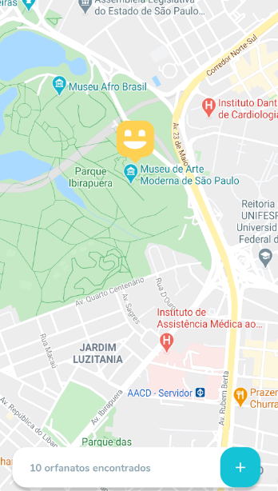
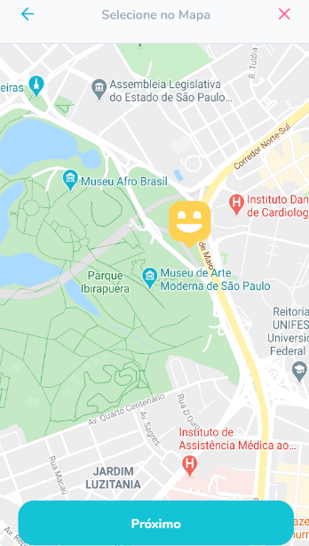
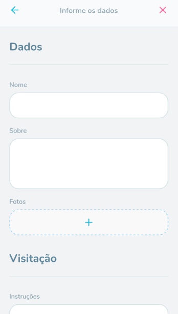

<h1 align="center">MOBILE</h1>

<h2>	📷 MOBILE</h2>

------------
<h2>🔖 Layout</h2>

📱 &nbsp; Check the Mobile layout on <a href="https://www.figma.com/file/dx2HBOkZup8P6xEWhXY6L3/Happy-Mobile">Figma</a>.

------------

<h2>📚 Documentation</h2>

🚧Under construction🚧.
Access <a href="https://github.com/Nandosbx/Happy-App/blob/master/DOCUMENTATION.md">Documentation</a> and learn more.

------------

<footer align="center">
 <strong align="center">Made with 💜 by Fernando Batista</strong>
</footer>
